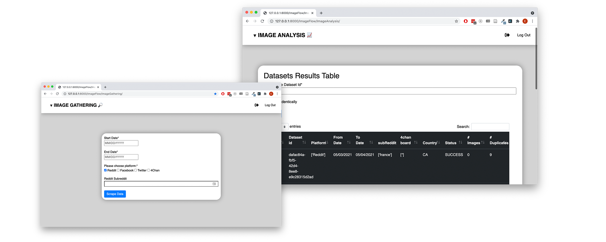
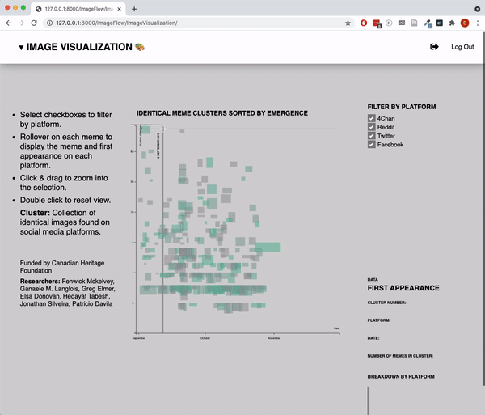

# ImageFlow
🔎 🗺️ Social Media Image Analysis Web App

[](https://travis-ci.org/badges/badgerbadgerbadger)


## Table of Contents

- [Introduction](#introduction)
- [Installation](#installation)
- [Web Scrapers](#web)
- [FAQ](#faq)


> This project is written in Python using Tweepy, PostgreSQL, Celery integrated into Django for an easy to use website interface.

## Introduction

<div align='center'></div>

<br />
This app is designed for social media researchers and other investigators who have access to academic API keys for major social media platforms. ImageFlow is useful for those who have to collect large databases of images and need a way to easily view how similar or identical images flow from platform to platform. 
<br /><br />
ImageFlow integrates the data gathering process by using four custom web scrapers: 4plebs (the archive for 4chan - since 4chan threads frequently expire), Facebook, Twitter, and Reddit. After the data gathering phase is complete the resulting image database can be clustered in the Image Analysis page. The user can choose to perform a clustering algorithm which will either cluster their database by similar images or by identical images. When the clustering is complete, the final result will show on the Image Visualization page. This page displays only the images that have been clustered, and shows the timeline of movement across platforms.

## Installation
Python 3.6


### Setup

> Update and install this package first


To run this server on your local host:

1) git clone this repo into your text editor

2) On the front page of this repo, copy the requirements.txt file into your project and download it

      a) need to download postgresql and requirements.txt
        
        brew install postgresql
        pip install -r requirements.txt 
               
3) Create a Django key and PostgreSQL database.

4) Edit file_path.py to point to the correct location of the File_Server directory. 


```
      class filepaths():
            file_server_path = 'Users/user/File_Server'
```


5) Edit the 'frontend_config.py' file in Website_Settings and add in your own key and database information.

       Django = {
           "Key": '',
       }

       PostgreSQL = {
           "UserName": "",
           "Password": "",
           "Name": "",
           "Host": "",
           "Port": ,
       }
        
6) Go into the DDI directory

        cd DDI_Website

7) Then once the above steps are completed, you now run in order in the terminal:

        python manage.py makemigrations
        python manage.py migrate
        python manage.py runserver // For just the regular server (for testing purposes)

8) Then create a new terminal instance while still in DDI_Website folder

        if windows 10:
            pip install gevent 
            celery -A Website_Settings worker -l info -P gevent
        if macOS:
            celery -A Website_Settings worker -l info

This will let you run your tasks in the background using Celery

Now the website is fully functional!

Just register a new user at http://127.0.0.1:8000/login/ and enjoy!

## Web Scrapers

There are four social media APIs used in this project:
- CrowdTangle
- 4Plebs
- PushShift
- Twitter

### Limitations

#### Crowdtangle

Posts and /posts/search will max out at 10,000 posts returned. You can ONLY search the PAGES and GROUPS that are in your dashboard.
The time between startDate and endDate must be less than a year. Can only handle 10k posts at a time.

#### Twitter

On this local-version of the ImageFlow web app you are able to search for particular users getting up to the most recent 3200 tweets, search via hashtag in the last 7 days using our non-premium or search the full archive of twitter using the premium twitter account

Once data has been searched for, you can query the data on the query tab and get a CSV file containing the tweets and some other useful fields in relation with them.


## FAQ

**What if nothing is showing up at my localhost URL?**

Try these two links, if one is not working than the other one should: <br />
http://127.0.0.1:8000/ <br />
http://127.0.0.1:8000/login/ <br />


